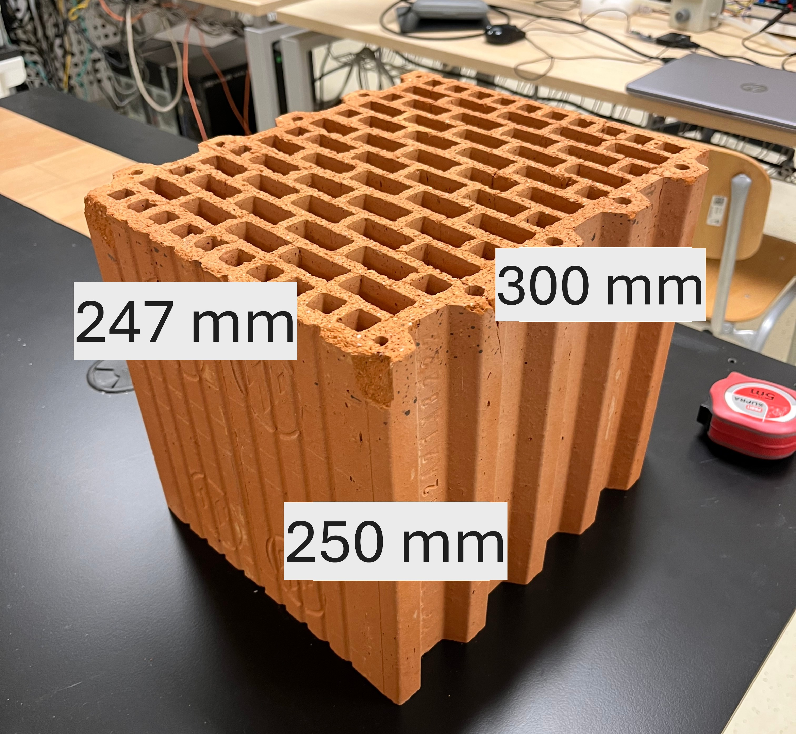
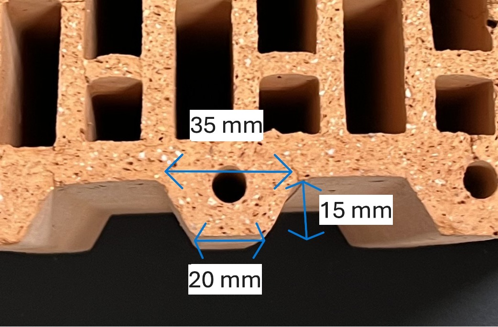
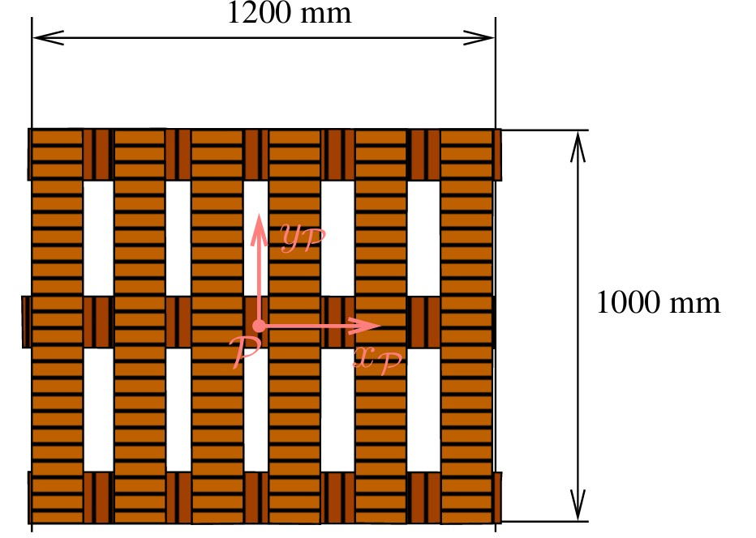
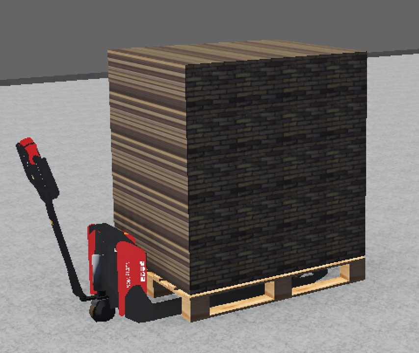

# rovozci pallet simulation
## Mujoco
For mujoco simulation, open the `mujoco` folder. The main xml file is `scene.xml`, and there are some sample python control scripts.
## Webots
`webots` folder contains necessary files for webots simulation. The simulation setup is mainly configured in `worlds` folder. To implement a controller, put the control script into the `controllers` folder.

## Plotting acceleration
`Acceleration` folder contains the raw data collected by using Physic Toolbox app. Note that except from `forward_emergency_max.csv` and `turn90plus_max`, 'ay' column corresponds to the forward acceleration. To plot the acceleration, execute `plot_acceleration.py`. It requires pandas and matplotlib. 
## pallet physical properties

    

        
        
<em>Figure 1: Overview of the brick</em>

    

    

        
        
<em>Figure 2: Detailed dimensions of the brick</em>

    

    

        
        
<em>Figure 3: Pallet dimensions</em>

    

    

        
        
<em>Figure 4: webots simulation environment</em>

    

* W: 4 * D: 4 * H: 5 = 80 bricks in total.
* each brick weights: 14.7 kg
* pallet weights: 20.0 kg
* total weights: 20.0 + 14.7 * 80 = 1196 kg
* more info about the brick
https://www.dek.cz/produkty/detail/4400820160-porotherm-cihla-30-profi-p10-24-7-30-24-9

